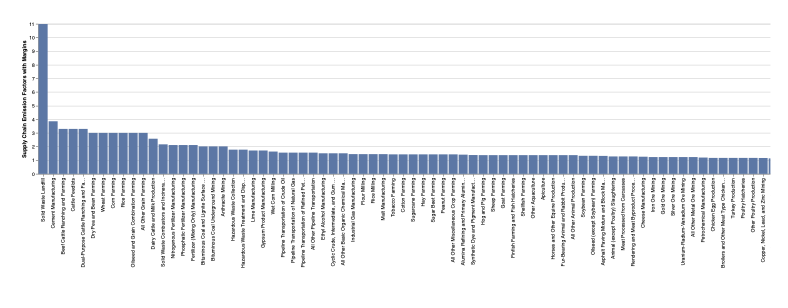
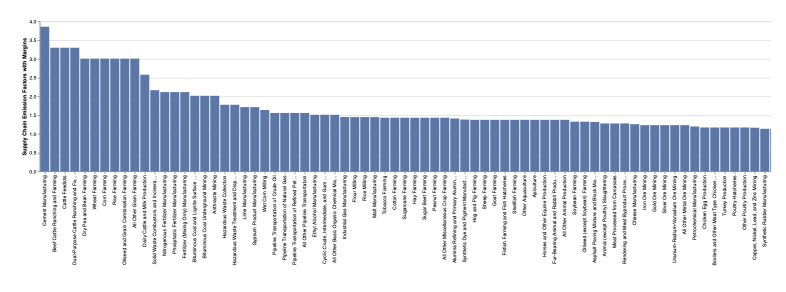

# GHG-Astair
A report on the Green House Gas Effect from Supply Chain

The source of my data is from the United States Environmental Protection Agency (US EPA) website. My dataset is related to the Greenhouse Gas (GHG) emission related to supply chain. The key attributes of my data are the supply chain emission factors for each category classified by the NAICS (North American Industry Classification System).
 
Environmental impacts from supply chains include water pollution, toxic waste, deforestation, air emission and greenhouse gas emission. According to US EPA, supply chains account for more than 90% of the GHG emissions. Because supply chains consume resources in large quantities, they cause a lot of carbon emissions. My objective is to find which supply chain emits most carbon equivalents per kilogram of material and how it is impacting the environment. This will help figure out a good sustainability approach for those products to help reduce the emissions.

I am considering a bar graph which shows the material on the x-axis and the supply chain emission factor / kg CO2 (One kg of CO2 equivalents is equivalent to the effect of one kg of CO2 emission) on the y-axis.  I created the graph with all the supply chain categories and realized that one of the categories (Solid Waste) was an outlier (Graph 1 below).  While all the other categories were between 0 and 4, Solid Waste category was close to 11. I wanted to look at a better representation of the rest of the graph. So, I took out the outlier and was able to get a better graphical representation of the rest of the categories based on their emission (Graph 2 below).

This is the first graph which includes all the categories including Solid Waste category.

This is the second graph which excludes the Solid Waste category to figure out how much the rest of the categories contribute to the greenhouse gas emission. 

Based on the first graph, Solid Waste is the main reason for the greenhouse gas emission in the US.  The second graph, which excludes the Solid Waste category, shows a better representation of the rest of the supply chain categories.  Here we see that Cement manufacturing is the next big contributor to the greenhouse gas followed closely by Beef/Cattle Ranching and Farming.
 
•	Why is a task pursued? (goal) – With the concern of air pollution everywhere, it calls for the necessity of finding what materials / food items factor into the increase in the emission. According to EIA “This imbalance between greenhouse gas emissions and the ability for natural processes to absorb those emissions has resulted in a continued increase in atmospheric concentrations of greenhouse gases.” So, trying to find the supply chain with the maximum greenhouse emission and seeing how we can help reduce it, will help with the air pollution issues we are all facing.

•	What does a task seek to learn about the data? (characteristics) – Figuring out the emission issues and causes will help us understand and study ways to see if there are better ways of producing those materials / food items that will not harm the environment.

•	Where does the task operate? (target data) – The target data for this task is the US, since the data is related to the supply chains in the US.

•	The target question you want to answer – How to reduce Green House Gas Emission, in order to help the environment.

•	The people you would recruit to answer that question – I am getting the help of my family and friends to check the results and help with the analysis.

•	The kinds of measures you would use to answer your data (e.g., insight depth, use cases, accuracy) and what these measures would tell you about the core question – I used insight.

•	The approach you will use to answer that question (e.g., a journaling study, a formal experiment, etc.) - I would use Systematic Surveys, which will help gain knowledge on the issues and find solutions.

•	How you would instantiate those methods (i.e., what would your participants do?) – I would observe the results and see where in which sector the problem is most occurring and how we can change / improve it to reduce the greenhouse gas emission.

•	What criteria would you use to indicate that your visualization was successful? – I would use comparison benchmarks to compare the results.

Even though this data shows us the emission for each category, there might still be some gaps. These could be because some emission categories might be unknown. The other reason is because some of the categories could be combined – for instance, Beef / Cattle Ranching, Cattle Feedlots and Dual-Purpose Cattle Ranching and Farming are more or less similar.

Either way, we can conclude that supply chains are one of the main contributors to the greenhouse emissions, with the Solid Waste category being extremely high compared to all the other categories whereas the Beef and Cattle Farming industry is the highest under edible products.
